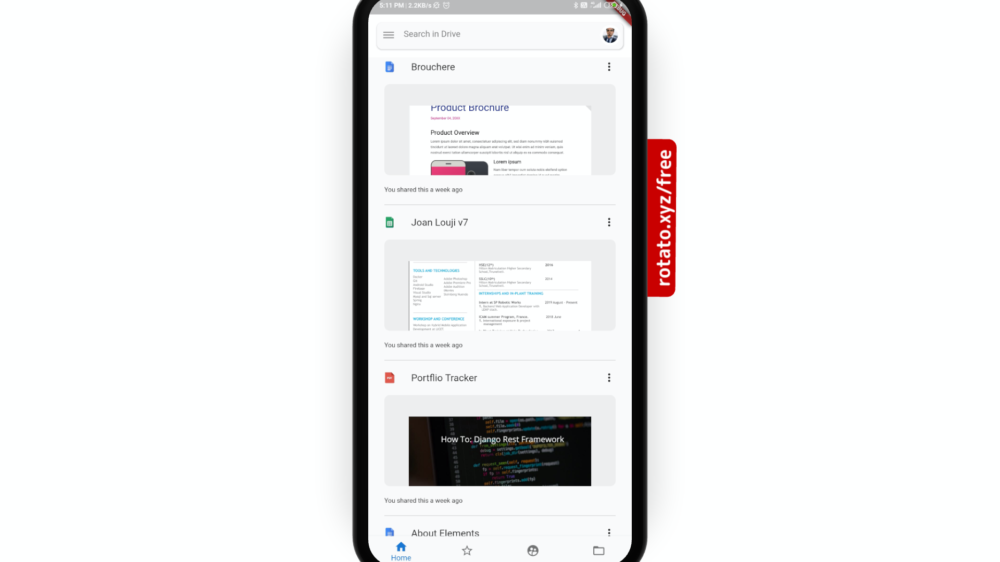

# Flutter drive Clone. 

Flutter Google Drive Clone. 
This is a simple flutter application where I have cloned Google Drive UI.
Created by [Joan Louji](https://joanlouji.web.app/)

## Installation

``` 

git clone https://github.com/sjlouji/GoogleDriveClone-Flutter.git
flutter pub get
flutter run 

```


## Demo

 <br>
 <br>
 <br>
 <br>
 <br>
 <br>

Thank you for your support. 

